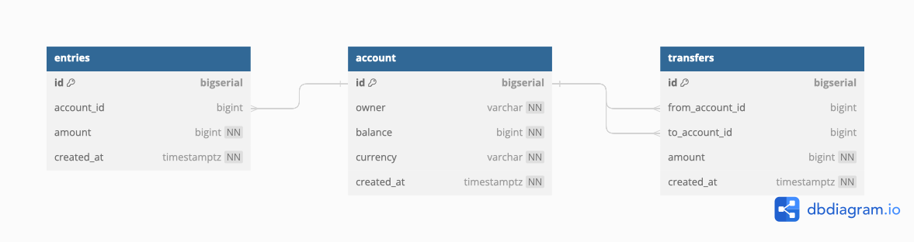
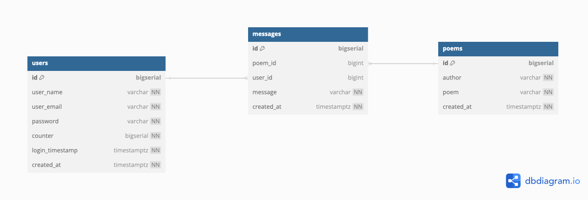

<link rel="preconnect" href="https://fonts.googleapis.com"> 
<link rel="preconnect" href="https://fonts.gstatic.com" crossorigin> 
<link href="https://fonts.googleapis.com/css2?family=Bangers&display=swap" rel="stylesheet">

# <mark style="font-family:Bangers;font-size: 100px">Golang + Postgres + Kubernetes + gRPC</mark>


<>
Implementation of a bank application

## Setting up the database

[dbdiagram.io](https://dbdiagram.io/home)

For the bank schema database we have



``` 
Table account as A {
  id bigserial [pk]
  owner varchar [not null]
  balance bigint [not null]
  currency varchar [not null]
  created_at timestamptz [not null, default: 'now()']
}

Table entries {
  id bigserial [pk]
  account_id bigint [ref: > A.id]
  amount bigint [not null, note: 'can be negative or positive']
  created_at timestamptz [not null, default: 'now()']

  Indexes {
    account_id
  }
}

Table transfers {
  id bigserial [pk]
  from_account_id bigint [ref: > A.id]
  to_account_id bigint [ref: > A.id]
  amount bigint [not null, note: 'must be positive']
  created_at timestamptz [not null, default: 'now()']

  Indexes {
    from_account_id
    to_account_id
    (from_account_id, to_account_id)
  }
}
```

Which generates the Postgress SQL commands:

```sql
CREATE TABLE "account" (
  "id" bigserial PRIMARY KEY,
  "owner" varchar NOT NULL,
  "balance" bigint NOT NULL,
  "currency" varchar NOT NULL,
  "created_at" timestamptz NOT NULL DEFAULT 'now()'
);

CREATE TABLE "entries" (
  "id" bigserial PRIMARY KEY,
  "account_id" bigint,
  "amount" bigint NOT NULL,
  "created_at" timestamptz NOT NULL DEFAULT 'now()'
);

CREATE TABLE "transfers" (
  "id" bigserial PRIMARY KEY,
  "from_account_id" bigint,
  "to_account_id" bigint,
  "amount" bigint NOT NULL,
  "created_at" timestamptz NOT NULL DEFAULT 'now()'
);

CREATE INDEX ON "entries" ("account_id");

CREATE INDEX ON "transfers" ("from_account_id");

CREATE INDEX ON "transfers" ("to_account_id");

CREATE INDEX ON "transfers" ("from_account_id", "to_account_id");

COMMENT ON COLUMN "entries"."amount" IS 'can be negative or positive';

COMMENT ON COLUMN "transfers"."amount" IS 'must be positive';

ALTER TABLE "entries" ADD FOREIGN KEY ("account_id") REFERENCES "account" ("id");

ALTER TABLE "transfers" ADD FOREIGN KEY ("from_account_id") REFERENCES "account" ("id");

ALTER TABLE "transfers" ADD FOREIGN KEY ("to_account_id") REFERENCES "account" ("id");

```


:::tip
Indexes are a common way to enhance database performance. 
An index allows the database server to find and retrieve specific rows much faster than it could do without an index. 
But indexes also add overhead to the database system as a whole, so they should be used sensibly.
:::


For the poems we have




```
Table poems as P {
  id bigserial [pk]
  author varchar [not null]
  poem varchar [not null]
  created_at timestamptz [not null, default: 'now()']
}

Table users as U {
  id bigserial [pk]
  user_name varchar [not null]
  user_email varchar [not null]
  password varchar [not null]
  counter bigserial [not null]
  login_timestamp timestamptz [not null, default: 'now()']
  created_at timestamptz [not null, default: 'now()']
}


Table messages as M {
  id bigserial [pk]
  poem_id bigint [ref: > P.id]
  user_id bigint [ref: > U.id]
  message varchar [not null]
  created_at timestamptz [not null, default: 'now()']
}
```
```
CREATE TABLE "poems" (
  "id" bigserial PRIMARY KEY,
  "author" varchar NOT NULL,
  "poem" varchar NOT NULL,
  "created_at" timestamptz NOT NULL DEFAULT 'now()'
);

CREATE TABLE "users" (
  "id" bigserial PRIMARY KEY,
  "user_name" varchar NOT NULL,
  "user_email" varchar NOT NULL,
  "password" varchar NOT NULL,
  "counter" bigserial NOT NULL,
  "login_timestamp" timestamptz NOT NULL DEFAULT 'now()',
  "created_at" timestamptz NOT NULL DEFAULT 'now()'
);

CREATE TABLE "messages" (
  "id" bigserial PRIMARY KEY,
  "poem_id" bigint,
  "user_id" bigint,
  "message" varchar NOT NULL,
  "created_at" timestamptz NOT NULL DEFAULT 'now()'
);

ALTER TABLE "messages" ADD FOREIGN KEY ("poem_id") REFERENCES "poems" ("id");

ALTER TABLE "messages" ADD FOREIGN KEY ("user_id") REFERENCES "users" ("id");

```


