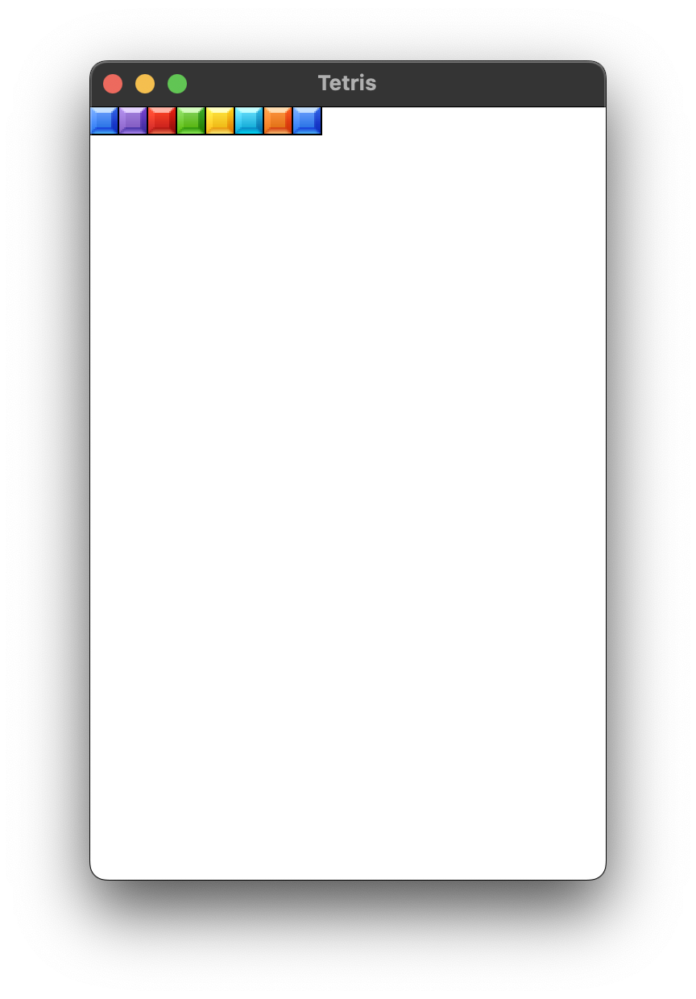
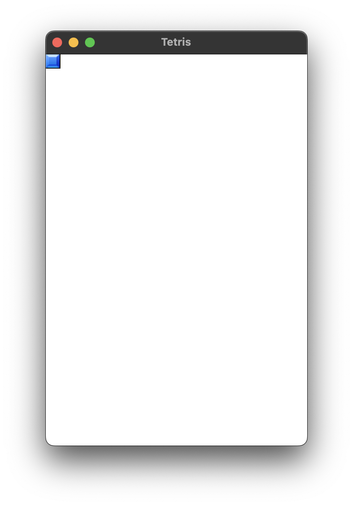

## 16 games in C++

## Installation

### SFML

[SFML GitHub](https://github.com/SFML/SFML)

```brew install sfml```

Adding SFML to cmake

```cmake 
cmake_minimum_required(VERSION 3.26)
project(01_tetris)

set(CMAKE_CXX_STANDARD 17)

set(CMAKE_BUILD_TYPE Release) 

include(FetchContent)
FetchContent_Declare(SFML COMPONENTS system window graphics network audio REQUIRED
        GIT_REPOSITORY https://github.com/SFML/SFML.git
        GIT_TAG 2.6.x)
FetchContent_MakeAvailable(SFML)

include_directories(${SFML_INCLUDE_DIR} ${PROJECT_SOURCE_DIR})


add_executable(01_tetris main.cpp)
target_link_libraries(${CMAKE_PROJECT_NAME} PRIVATE sfml-graphics)
target_compile_features(${CMAKE_PROJECT_NAME} PRIVATE cxx_std_17)
```


### Tetris


Let's start by creating a jpg with the Tetris tiles, called `tiles.jpg`.

First let's create a window:


```cpp
#include <SFML/Graphics.hpp>
#include <ctime>

using namespace sf;

int main() {
    sf::RenderWindow window(sf::VideoMode(320, 480), "Tetris");

    while (window.isOpen())
    {
        Event e{};
        while (window.pollEvent(e))
        {
            if (e.type == sf::Event::Closed)
                window.close();
        }

        window.clear(Color::White);
        window.display();

    }
    return 0;
}
```


Now let's create a `Sprite` with the `tiles.jpg` file using a texture.


```cpp 
sf::Texture t;
t.loadFromFile("images/tiles.jpg");
Sprite s(t);
```

and 

```cpp
window.draw(s);
```

full code:

```cpp 
#include <SFML/Graphics.hpp>
//#include <ctime>

int main() {
    sf::RenderWindow window(sf::VideoMode(320, 480), "Tetris");
    sf::Texture t;
    t.loadFromFile("../images/tiles.png");

    sf::Sprite s(t);

    while (window.isOpen()) {
        sf::Event e{};
        while (window.pollEvent(e)) {
            if (e.type == sf::Event::Closed)
                window.close();
        }

        window.clear(sf::Color::White);
        window.draw(s);
        window.display();

    }
    return 0;
}
```

Result:



Now we isolate the Sprite texture's first square with `s.setTextureRect(sf::IntRect(0,0,18,18));`



Now we can code the blocks' shapes.

```cpp

const int M = 20;
const int N = 10;

int field[M][N] = {0};

int figures[7][4] =
        {
            1,3,5,7,    // I
            2,4,5,7,    // Z
            3,5,4,6,    // S
            3,5,4,7,    // T
            2,3,5,7,    // L
            3,5,7,6,    // J
            2,3,4,5,    // O
        };
```


Then we create an `struct Point`

```cpp
struct Point {int x,y;} a[4], b[4];
```

and draw a figure

```cpp
int n=1;
for (int i = 0; i < 4; ++i) {
    a[i].x = figures[n][i] % 2;
    a[i].y = figures[n][i] / 2;
}

window.clear(sf::Color::White);

for (int i = 0; i < 4; ++i) {
    s.setPosition(a[i].x*18, a[i].y*18);
    window.draw(s);
}
```


now we create

```cpp
int dx=0; bool rotate=0; int colorNum=1;
```

