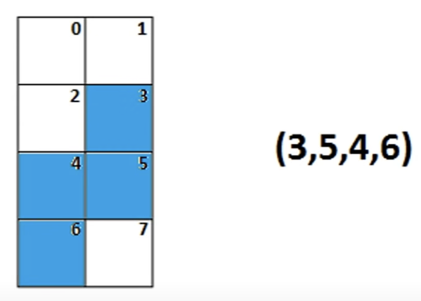
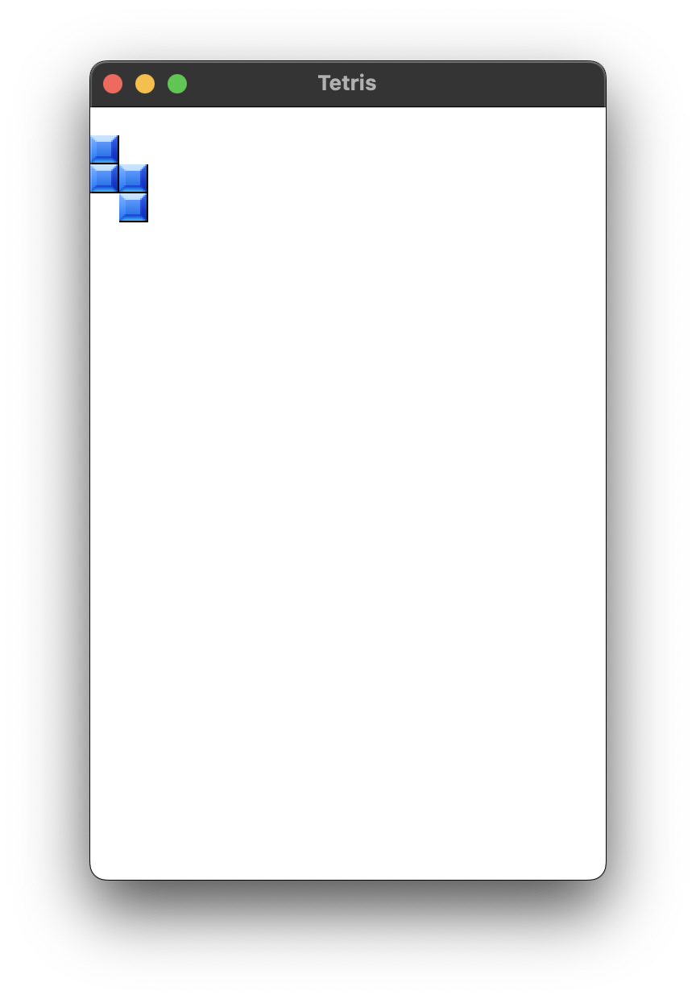

## 16 games in C++

## Installation

### SFML

[SFML GitHub](https://github.com/SFML/SFML)

```brew install sfml```

Adding SFML to cmake

```cmake 
cmake_minimum_required(VERSION 3.26)
project(01_tetris)

set(CMAKE_CXX_STANDARD 17)

set(CMAKE_BUILD_TYPE Release) 

include(FetchContent)
FetchContent_Declare(SFML COMPONENTS system window graphics network audio REQUIRED
        GIT_REPOSITORY https://github.com/SFML/SFML.git
        GIT_TAG 2.6.x)
FetchContent_MakeAvailable(SFML)

include_directories(${SFML_INCLUDE_DIR} ${PROJECT_SOURCE_DIR})


add_executable(01_tetris main.cpp)
target_link_libraries(${CMAKE_PROJECT_NAME} PRIVATE sfml-graphics)
target_compile_features(${CMAKE_PROJECT_NAME} PRIVATE cxx_std_17)
```


### Tetris


Let's start by creating a jpg with the Tetris tiles, called `tiles.jpg`.

First let's create a window:


```cpp
#include <SFML/Graphics.hpp>
#include <ctime>

using namespace sf;

int main() {
    sf::RenderWindow window(sf::VideoMode(320, 480), "Tetris");

    while (window.isOpen())
    {
        Event e{};
        while (window.pollEvent(e))
        {
            if (e.type == sf::Event::Closed)
                window.close();
        }

        window.clear(Color::White);
        window.display();

    }
    return 0;
}
```


Now let's create a `Sprite` with the `tiles.jpg` file using a texture.


```cpp 
sf::Texture t;
t.loadFromFile("images/tiles.jpg");
Sprite s(t);
```

and 

```cpp
window.draw(s);
```

full code:

```cpp 
#include <SFML/Graphics.hpp>
//#include <ctime>

int main() {
    sf::RenderWindow window(sf::VideoMode(320, 480), "Tetris");
    sf::Texture t;
    t.loadFromFile("../images/tiles.png");

    sf::Sprite s(t);

    while (window.isOpen()) {
        sf::Event e{};
        while (window.pollEvent(e)) {
            if (e.type == sf::Event::Closed)
                window.close();
        }

        window.clear(sf::Color::White);
        window.draw(s);
        window.display();

    }
    return 0;
}
```

Result:


Now we isolate the Sprite texture's first square with `s.setTextureRect(sf::IntRect(0,0,18,18));`


Now we can code the blocks' shapes.

```cpp

const int M = 20;
const int N = 10;

int field[M][N] = {0};

int figures[7][4] =
        {
            1,3,5,7,    // I
            2,4,5,7,    // Z
            3,5,4,6,    // S
            3,5,4,7,    // T
            2,3,5,7,    // L
            3,5,7,6,    // J
            2,3,4,5,    // O
        };
```




Then we create an `struct Point`

```cpp
struct Point {int x,y;} a[4], b[4];
```

and draw a figure

```cpp
int n=1;
for (int i = 0; i < 4; ++i) {
    a[i].x = figures[n][i] % 2;
    a[i].y = figures[n][i] / 2;
}

window.clear(sf::Color::White);

for (int i = 0; i < 4; ++i) {
    s.setPosition(a[i].x*18, a[i].y*18);
    window.draw(s);
}
```


:::tip
`%` gives you the remainder of integer division.

`a[0].x = figures[0][0] % 2;` ----->  `1%2` is 1 because 1 divided by 2 is 0 remainder 1.

`1/2` gives 0 as output because they are int by default.


1,3,5,7,    // I

2,4,5,7,    // Z

For n=0

a[i].x: 1 a[i].y: 0

a[i].x: 1 a[i].y: 1

a[i].x: 1 a[i].y: 2

a[i].x: 1 a[i].y: 3

For n=1

a[i].x: 0 a[i].y: 1

a[i].x: 0 a[i].y: 2

a[i].x: 1 a[i].y: 2

a[i].x: 1 a[i].y: 3


*18

a[i].x: 0 a[i].y: 1 a[i].x*18: 0 a[i].y*18: 18                X

a[i].x: 0 a[i].y: 2 a[i].x*18: 0 a[i].y*18: 36                XX

a[i].x: 1 a[i].y: 2 a[i].x*18: 18 a[i].y*18: 36                X

a[i].x: 1 a[i].y: 3 a[i].x*18: 18 a[i].y*18: 54




This part of the Tetris code is crucial for defining the shape and orientation of the Tetris pieces. Let's break it down:

```cpp
for (int i = 0; i < 4; ++i) {
    a[i].x = figures[n][i] % 2;
    a[i].y = figures[n][i] / 2;
}
```


- **2x4 Grid Representation**: Here, each Tetris piece is defined by four blocks (`i` ranging from 0 to 3), and the position of each block is calculated using the `figures[n][i]` values. The use of modulo 2 (`% 2`) and integer division by 2 (`/ 2`) suggests a grid with 2 columns (x-coordinates 0 or 1) and 4 rows (y-coordinates 0 to 3).

- **Modulo 2 for x-coordinate**: The `a[i].x = figures[n][i] % 2;` line assigns the x-coordinate of each block within a width of 2 columns.

- **Division by 2 for y-coordinate**: The `a[i].y = figures[n][i] / 2;` line calculates the y-coordinate, effectively distributing the block positions over 4 rows.

This structure allows each piece's shape and orientation to be encoded using the `figures` array. The specific values in this array determine how the blocks are positioned in the 2x4 grid to form the different Tetris pieces. For example, the 'I' piece would be represented with all blocks in a straight line, either horizontally or vertically, within this grid.
:::

now we create

```cpp
int dx=0; bool rotate=0; int colorNum=1;
```

